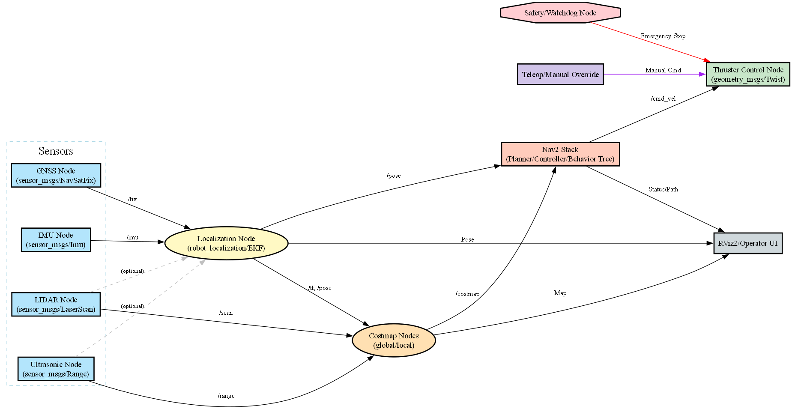
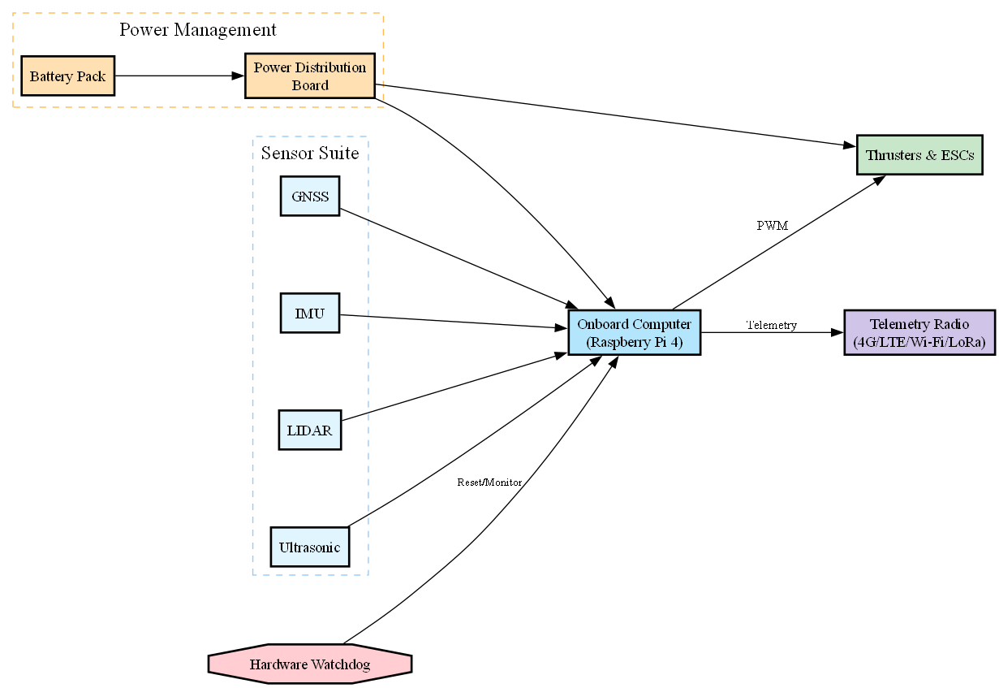
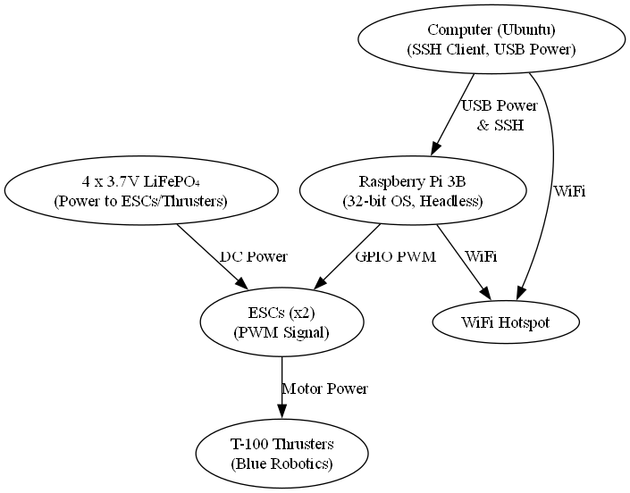
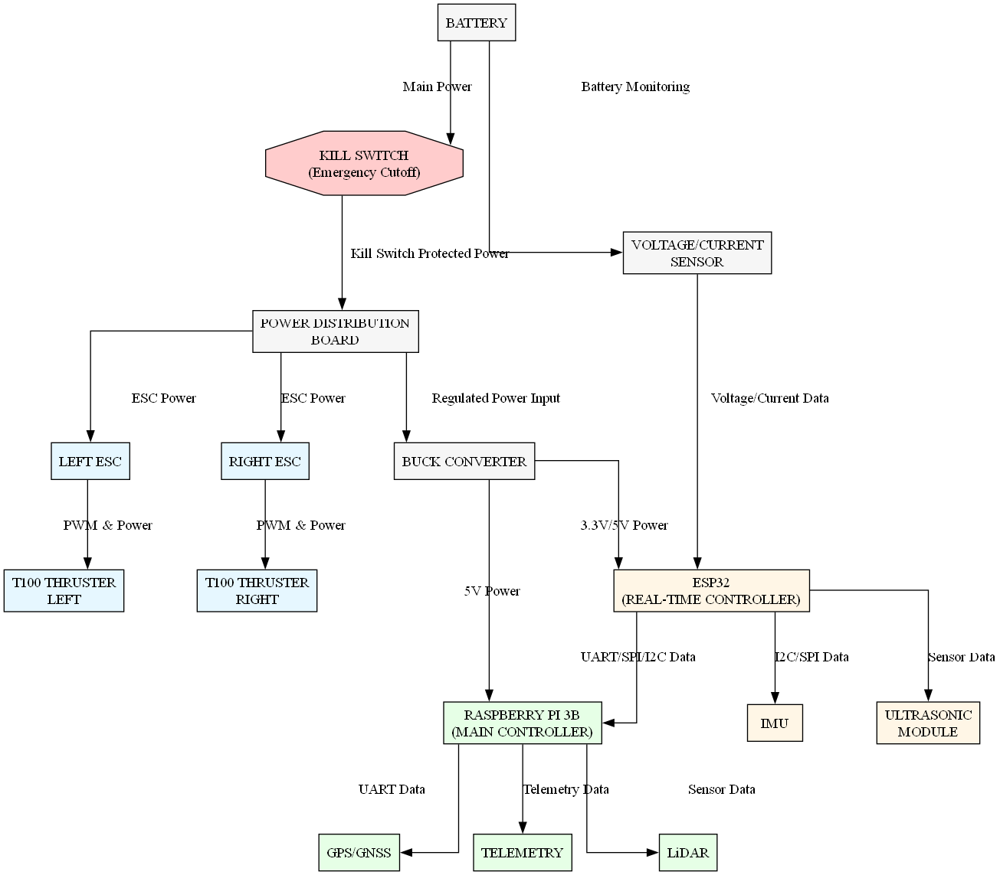

# Autonomous Catamaran - IIT Kharagpur

<p align="center">
  
</p>

<h3 align="center">
ROS 2 Based Autonomous Surface Vehicle for Navigation, Perception, Control and Teleoperation
</h3>

<p align="center">
  <a href="https://github.com/ShazinHijazy/Autonomous-Catamaran-IIT-KGP">
    
  </a>
  <a href="https://docs.ros.org/en/humble/">
    
  </a>
  <a href="https://www.raspberrypi.com/products/raspberry-pi-4-model-b/">
    
  </a>
  
</p>

<p align="center">
  <strong>Robotics and Autonomous Navigation Internship</strong><br>
  Department of Ocean Engineering and Naval Architecture<br>
  Indian Institute of Technology Kharagpur
</p>

---

## Table of Contents

- [Overview](#overview)
- [Project Context](#project-context)
- [Objectives](#objectives)
- [System at a Glance](#system-at-a-glance)
- [System Architecture](#system-architecture)
- [Hardware](#hardware)
- [Software Stack](#software-stack)
- [Perception and Sensor Layer](#perception-and-sensor-layer)
- [Localization and Sensor Fusion](#localization-and-sensor-fusion)
- [Mapping and Obstacle Avoidance](#mapping-and-obstacle-avoidance)
- [Navigation](#navigation)
- [Thruster Control](#thruster-control)
- [Teleoperation](#teleoperation)
- [Telemetry](#telemetry)
- [Safety and Fail-Safe Operation](#safety-and-fail-safe-operation)
- [Simulation](#simulation)
- [Testing and Validation](#testing-and-validation)
- [Reported Performance](#reported-performance)
- [Repository Structure](#repository-structure)
- [Installation](#installation)
- [Running the Thruster Controller](#running-the-thruster-controller)
- [ROS 2 Development](#ros-2-development)
- [Development Methodology](#development-methodology)
- [Challenges](#challenges)
- [Limitations and Scope](#limitations-and-scope)
- [Future Research Directions](#future-research-directions)
- [Project Documentation](#project-documentation)
- [Academic Context](#academic-context)
- [Contributors](#contributors)
- [Acknowledgements](#acknowledgements)
- [References](#references)
- [Citation](#citation)
- [Safety Notice](#safety-notice)
- [Project Status](#project-status)

---

# Overview

This repository contains the software, simulation resources, control modules, sensor interfaces, navigation components, telemetry utilities and supporting documentation developed for an **Autonomous Surface Vehicle (ASV) based on a catamaran platform**.

The project was developed during a **Robotics and Autonomous Navigation Internship at the Department of Ocean Engineering and Naval Architecture, Indian Institute of Technology Kharagpur**.

The primary objective was to develop and integrate a modular robotics system capable of supporting autonomous and remotely supervised operation of a small surface vehicle.

The work brings together:

- ROS 2 based robotics software
- Onboard computing
- Marine sensing
- Localization
- Sensor fusion
- Mapping
- Obstacle detection
- Navigation
- Differential thruster control
- Telemetry
- Manual intervention
- Fail-safe mechanisms
- Simulation
- Bench testing
- Controlled field testing

The repository represents the engineering and research work carried out across these components and preserves different stages of the development process.

---

# Project Context

Autonomous Surface Vehicles operate in environments where reliable navigation is affected by changing surroundings, sensor limitations, communication constraints, environmental disturbances and the absence of fixed infrastructure.

A practical autonomous marine robotics platform therefore requires more than a propulsion system.

It needs a complete chain:

```text
Sensing
   ↓
State Estimation
   ↓
Perception
   ↓
Mapping
   ↓
Navigation
   ↓
Control
   ↓
Actuation
   ↓
Vehicle Motion
   ↓
Sensor Feedback
   └───────────────→ Continuous Update
````

This project explored that complete robotics pipeline using a modular ROS 2 based architecture.

The intention was to establish a research platform that could be extended toward applications such as:

* Environmental monitoring
* Autonomous surveying
* Marine research
* Water-body inspection
* Autonomous patrol
* Navigation research
* Multi-vehicle coordination
* Other autonomous surface robotics applications

---

# Objectives

The major objectives of the project were to:

1. Develop a modular autonomous surface vehicle architecture.

2. Integrate marine-suitable sensing and actuation hardware.

3. Establish ROS 2 based communication between sensing, localization, navigation and control modules.

4. Implement localization using GNSS and inertial sensing.

5. Explore sensor fusion for improved state estimation.

6. Integrate LiDAR and short-range sensing for environmental perception.

7. Develop mapping and obstacle representation for navigation.

8. Configure the ROS 2 Navigation2 stack for autonomous navigation.

9. Develop differential thruster control for vehicle maneuvering.

10. Support both autonomous and remotely controlled operation.

11. Implement telemetry and operator supervision.

12. Develop safety and recovery mechanisms.

13. Validate the system incrementally through simulation, bench testing and controlled field trials.

---

# System at a Glance

The platform can be understood as five major layers:

```text
┌───────────────────────────────────────────────────────┐
│                  OPERATOR / MISSION                  │
│             RViz2 • Teleoperation • Telemetry        │
└───────────────────────────┬───────────────────────────┘
                            │
                            ▼
┌───────────────────────────────────────────────────────┐
│                     NAVIGATION                        │
│          Nav2 • Planning • Waypoints • Recovery      │
└───────────────────────────┬───────────────────────────┘
                            │
                            ▼
┌───────────────────────────────────────────────────────┐
│              LOCALIZATION & PERCEPTION               │
│       GNSS • IMU • LiDAR • Ultrasonic • SLAM         │
└───────────────────────────┬───────────────────────────┘
                            │
                            ▼
┌───────────────────────────────────────────────────────┐
│                    CONTROL                            │
│       ROS 2 Control • PWM • ESC • Differential       │
│                       Thrust                          │
└───────────────────────────┬───────────────────────────┘
                            │
                            ▼
┌───────────────────────────────────────────────────────┐
│                AUTONOMOUS CATAMARAN                  │
│             T100 Thruster Based Platform             │
└───────────────────────────────────────────────────────┘
```

---

# System Architecture

The system follows a modular hardware-software architecture centred around ROS 2.

<p align="center">
  
</p>

At a high level, sensor data is acquired from the vehicle, processed through ROS 2 nodes and used by localization, mapping and navigation components.

Navigation outputs are converted into control commands, which are then translated into actuator commands for the propulsion system.

The vehicle continuously feeds new sensor information back into the software stack.

---

# Hardware

The primary integrated platform consists of the following major components.

| Component                     | Role                                  |
| ----------------------------- | ------------------------------------- |
| Raspberry Pi 4 Model B        | Onboard computation                   |
| RPLIDAR                       | 2D laser-based perception and mapping |
| GNSS Receiver                 | Global positioning                    |
| IMU                           | Orientation and motion sensing        |
| Waterproof Ultrasonic Sensors | Short-range obstacle detection        |
| Blue Robotics T100 Thrusters  | Propulsion and maneuvering            |
| Electronic Speed Controllers  | Thruster actuation                    |
| Battery System                | Power source                          |
| Power Distribution            | Electrical power distribution         |
| Telemetry Module              | Remote communication                  |
| Catamaran Hull                | Autonomous surface vehicle platform   |

The internship report describes the Raspberry Pi 4B as the onboard computer running Ubuntu 22.04 and ROS 2, with GNSS, IMU, RPLIDAR, ultrasonic sensors, T100 thrusters and telemetry forming the main integrated hardware stack.

---

# Hardware Architecture

<p align="center">
  
</p>

The hardware architecture separates:

* Computing
* Sensing
* Power
* Communication
* Actuation
* Safety

This separation makes the platform easier to debug, maintain and extend.

---

# Sensor and Perception Layer

The perception layer provides environmental and vehicle-state information to the rest of the robotics system.

The main sensors include:

### GNSS

Provides global position information for navigation and mission execution.

### IMU

Provides orientation and inertial measurements used for state estimation and sensor fusion.

### RPLIDAR

Provides two-dimensional laser measurements for:

* Obstacle detection
* Mapping
* Local environmental representation

### Waterproof Ultrasonic Sensors

Provide short-range distance measurements that can complement LiDAR-based perception, particularly near the vehicle.

---

# Localization and Sensor Fusion

Localization is responsible for estimating the vehicle's state from available sensor information.

The project explored the combination of:

* GNSS
* IMU
* Odometry
* LiDAR based localization
* Extended Kalman Filter based sensor fusion
* SLAM based localization

A sensor-fusion layer can be represented as:

```text
GNSS ──────────┐
               │
IMU ───────────┼──────► Sensor Fusion ──────► Vehicle State
               │
Odometry ──────┘
```

The internship implementation describes the use of an Extended Kalman Filter through the `robot_localization` ecosystem for combining GNSS and IMU information.

The architecture also considered SLAM-based localization for environments where GNSS availability may be limited.

---

# Mapping and Obstacle Avoidance

The vehicle uses range sensing to construct a representation of nearby obstacles.

The navigation system uses costmaps to represent the environment for planning and control.

A simplified data flow is:

```text
RPLIDAR
   │
   ▼
Laser Scan
   │
   ▼
Obstacle Processing
   │
   ▼
Local Costmap
   │
   ▼
Navigation Controller
   │
   ▼
Thruster Commands
```

Ultrasonic sensing can provide additional short-range information for obstacle detection.

The repository contains dedicated components for obstacle avoidance and related navigation functionality.

---

# Navigation

The navigation layer is built around the ROS 2 Navigation2 ecosystem.

The navigation stack is intended to support:

* Global planning
* Local control
* Waypoint navigation
* Obstacle-aware navigation
* Recovery behaviours
* Mission execution
* Return-to-base functionality

Conceptually:

```text
Mission / Waypoints
        │
        ▼
Localization
        │
        ▼
Map / Costmap
        │
        ▼
Global Planner
        │
        ▼
Local Controller
        │
        ▼
Velocity / Control Command
        │
        ▼
Thruster Controller
        │
        ▼
Vehicle
```

The project architecture uses ROS 2 topics and nodes to maintain separation between sensing, localization, planning and actuation.

---

# Thruster Control

The catamaran uses two T100 thrusters for propulsion and differential maneuvering.

The thruster-control layer converts control commands into PWM signals for the electronic speed controllers.

The repository contains multiple implementations and development stages, including:

* Standalone Python based thruster control
* ROS 2 based thruster control
* Remote thruster control
* Teleoperation
* Supporting control and architecture scripts

The basic control chain is:

```text
ROS 2 / Operator Command
          │
          ▼
Thruster Controller
          │
     ┌────┴────┐
     ▼         ▼
Left ESC    Right ESC
     │         │
     ▼         ▼
Left T100   Right T100
```

---

# Thruster Safety

The control implementation incorporates neutralization and shutdown behaviour.

A typical shutdown sequence places both thrusters into a neutral state before terminating the PWM interface.

This is particularly important when working with physical propulsion systems.

---

# Teleoperation

The platform supports manual operation for testing, supervision and intervention.

The repository contains custom teleoperation implementations that provide differential control of the two thrusters.

The documented keyboard interface includes:

| Key | Function                |
| --- | ----------------------- |
| `W` | Increase forward thrust |
| `S` | Increase reverse thrust |
| `A` | Turn left               |
| `D` | Turn right              |
| `R` | Reset to neutral        |
| `Q` | Quit                    |

Some earlier controller implementations in the repository also include additional controls for individual thruster adjustment, pause/resume and emergency stop.

The exact controls depend on which controller implementation is being used.

---

# Telemetry

Telemetry provides a communication path between the vehicle and an external operator.

The system can support:

* Remote monitoring
* Command transmission
* Mission supervision
* Vehicle-state monitoring
* Manual intervention
* Mission status reporting

Telemetry was treated as an important part of the overall system because autonomous operation should not be considered independently of operator supervision and recovery.

---

# Safety and Fail-Safe Operation

Safety is addressed through multiple layers.

These include:

* Manual override
* Emergency stop
* Thruster neutralization
* Watchdog mechanisms
* Fail-safe return functionality
* Recovery behaviours
* Telemetry supervision
* Power monitoring
* Incremental testing

The repository contains a dedicated `fail_safe_return` component.

The intended safety philosophy is:

```text
Normal Operation
       │
       ▼
System Monitoring
       │
       ├──── Healthy ────► Continue Mission
       │
       └──── Fault ──────► Recovery / Safe State
                              │
                              ▼
                       Operator Intervention
```

Safety mechanisms should always be validated independently before physical deployment.

---

# Simulation

Simulation was used as part of the development process to test software behaviour before and alongside physical deployment.

The repository contains simulation-related scripts including:

* `2D Simulation.py`
* `3D Simulation.py`
* `CatamaranSimulation.py`
* Catamaran model resources
* Architecture visualization scripts
* Data-flow visualization scripts

Simulation allows the software architecture and navigation logic to be investigated in a controlled environment.

---

# Visualization

RViz2 is used for visualization and monitoring of the robotics system.

It can provide visualization of:

* Robot state
* Sensor information
* Maps
* Navigation goals
* Planned paths
* Localization information
* Navigation behaviour

The repository also contains architecture and data-flow diagrams under the `media` directory.

---

# Testing and Validation

The project followed an incremental testing approach.

## 1. Software Testing

ROS 2 nodes and communication interfaces were tested individually to verify:

* Topic communication
* Sensor data publication
* Control commands
* Navigation behaviour
* Node interactions

## 2. Simulation Testing

The navigation and control stack was tested in simulation using Gazebo and RViz2.

## 3. Bench Testing

Hardware was tested before water deployment.

Testing included:

* Sensor operation
* Thruster response
* PWM generation
* Power stability
* Communication
* ROS 2 integration

## 4. Controlled Field Testing

Physical testing was conducted progressively.

The testing sequence followed:

```text
Manual Teleoperation
        ↓
Basic System Validation
        ↓
Semi-Autonomous Testing
        ↓
Autonomous Navigation
        ↓
Parameter Calibration
        ↓
Performance Evaluation
```

The internship report describes simulation testing, dry-run bench testing and controlled water trials as part of the development and validation process.

---

# Development Methodology

The overall development process followed a modular engineering workflow.

```text
Requirements Analysis
        ↓
System Architecture
        ↓
Hardware Selection
        ↓
Hardware Integration
        ↓
Sensor Interface Development
        ↓
ROS 2 Node Development
        ↓
Localization / Sensor Fusion
        ↓
Mapping / Perception
        ↓
Navigation Configuration
        ↓
Thruster Control
        ↓
Simulation Testing
        ↓
Bench Testing
        ↓
Controlled Field Trials
        ↓
Calibration and Tuning
        ↓
Performance Evaluation
```

This approach was used to reduce the complexity of integrating the complete system at once.

---

# Reported Performance

The following results are reported in the accompanying IIT Kharagpur internship report for the documented testing scenarios.

| Metric                     |                 Reported Result |
| -------------------------- | ------------------------------: |
| Mean localization error    |                           0.8 m |
| Maximum localization error |                           2.1 m |
| Waypoint completion rate   |                             94% |
| Average path deviation     |                           1.2 m |
| Mission time deviation     | Within 10% of planned estimates |
| Detected obstacles avoided |     100% during reported trials |
| System uptime              |                             98% |
| Average current draw       |                           2.3 A |
| Peak current draw          |                           3.1 A |
| Continuous operation       |                       4.5 hours |
| Telemetry packet loss      |           Below 1% within 300 m |
| Average command latency    |                           90 ms |

These figures describe the test scenarios documented in the internship report. They should not be interpreted as universal performance guarantees for the platform or for other operating environments.

The report describes the localization, waypoint, obstacle avoidance, uptime, power and telemetry measurements in its performance evaluation section.

---

# Challenges

Marine autonomous navigation introduces several practical challenges.

## GNSS Availability

GNSS availability can degrade in environments such as areas underneath bridges or near structures.

The system therefore considered inertial information and sensor fusion as complementary sources of localization information.

## Sensor Calibration

Sensor alignment and calibration can affect localization and perception.

Calibration and parameter tuning were therefore included in the testing process.

## Power Variation

High-thrust manoeuvres can produce increased current demand.

Power consumption was included as one of the system evaluation parameters.

## Telemetry Reliability

Remote supervision depends on communication reliability.

Telemetry range, packet loss and command latency were therefore considered during evaluation.

## Environmental Uncertainty

Water environments introduce disturbances that are not always present in conventional indoor or ground-robot experiments.

This makes incremental field testing particularly important.

---

# Limitations and Scope

This repository should be understood as a **research and engineering development platform**, not as a certified autonomous marine navigation product.

Several factors can affect real-world performance:

* Water conditions
* Wind
* Currents
* Sensor placement
* GNSS availability
* Communication range
* Battery condition
* Vehicle loading
* Hardware configuration
* Environmental obstacles
* Navigation parameters

Performance values reported in the internship documentation correspond to specific testing conditions.

They should therefore be reproduced and independently validated before being used as design guarantees.

---

# Future Research Directions

The platform provides a foundation for further development.

Potential research directions include:

### Improved Localization

* GNSS-denied navigation
* Visual-inertial odometry
* Improved sensor fusion
* Robust state estimation

### Advanced Perception

* Camera-based perception
* Improved LiDAR processing
* Multi-modal perception
* Environmental classification

### Navigation

* Adaptive path planning
* Current-aware navigation
* Weather-aware mission planning
* Improved recovery behaviours
* Autonomous docking

### Marine Applications

* Environmental monitoring
* Water-quality sensing
* Bathymetric mapping
* Marine surveying
* Search and rescue research

### Multi-Vehicle Autonomy

* Multi-ASV coordination
* Collaborative area coverage
* Distributed mission planning
* Cooperative sensing

### Intelligent Autonomy

* Machine-learning-assisted navigation
* Adaptive control
* Fault detection
* Fault recovery
* Human-robot interaction

These directions are consistent with the research extensions identified in the internship documentation.

---

# Repository Structure

The repository currently contains several development modules, ROS 2 components, simulations, diagrams and supporting resources.

```text
Autonomous-Catamaran-IIT-KGP/
│
├── References and Resources/
│
├── SLAM/
├── Sensor_Nodes/
├── docs/
├── etc/
├── fail_safe_return/
├── html/
├── launch_codes/
├── logger/
├── media/
├── navigation2/
├── obstacle_avoidance/
├── package/
├── rvizz/
├── setup/
├── telemetry/
├── thrusters/
├── updated_tested_and_debugged_code/
├── x86/
│
├── 2D Simulation.py
├── 3D Simulation.py
├── Architecture.py
├── CatamaranSimulation.py
├── DataFlowDiagram.py
├── DirectoryStructureforROS2.txt
├── PackageForROS2.xml
├── RemotelyControlledThrusterControlServerwithoutROS2.py
├── RemotelyOperatedCatamaranFlowChart.py
├── RemotelyOperatedCatamaranHardwareArchitecture.py
├── RemotelyOperatedCatamaranSoftwareFlowChart.py
├── RemotelyOperatedCatamaranThrusterControlClientwithoutROS2.py
├── RemotelyOperatedCatamaranThrusterControlSetupusingROS2.py
├── RemotelyOperatedCatamaranThrusterControlusingROS2.py
├── SoftwareDataFlowDiagram.py
├── STL Model of The Catamaran.py
├── ThrusterControl.py
├── ThrusterControlRoS2.py
├── WiringDiagram Powerbank and SMPS.py
├── custom_teleop.py
├── catamaran_model_25cm_deck.stl
├── package.xml
├── setup.py
├── README.md
└── SECURITY.md
```

The repository currently contains multiple experimental and development components. Not every file represents the same stage of the final integrated system.

---

# Important Repository Components

## `SLAM/`

Resources associated with simultaneous localization and mapping experiments.

## `Sensor_Nodes/`

Sensor interfaces and ROS 2 related sensing components.

## `navigation2/`

Navigation2 related configuration and development resources.

## `obstacle_avoidance/`

Obstacle detection and avoidance related components.

## `telemetry/`

Communication and telemetry related resources.

## `fail_safe_return/`

Fail-safe and return behaviour related resources.

## `thrusters/`

Thruster control and actuation components.

## `launch_codes/`

ROS 2 launch and system startup resources.

## `logger/`

Logging and data-recording related resources.

## `rvizz/`

RViz2 and visualization related resources.

## `updated_tested_and_debugged_code/`

Later development versions and tested/debugged code.

## `media/`

Architecture diagrams, data-flow diagrams, wiring diagrams and supporting visual documentation.

---

# Media and Architecture Diagrams

The repository contains several system diagrams under `media/`.

Important diagrams include:

* Autonomous Catamaran Architecture
* ROS 2 System Architecture
* Hardware Architecture
* Software Data Flow
* Data Flow Diagrams
* Wiring Diagram
* Thruster Block Diagram
* Kill-Switch Wiring Diagram

Examples:

<p align="center">
  
</p>

<p align="center">
  
</p>

---

# Installation

## Prerequisites

The integrated development environment described in the internship documentation includes:

* Ubuntu 22.04
* ROS 2 Humble
* Python
* Raspberry Pi 4 Model B
* Required ROS 2 packages
* Sensor-specific drivers
* pigpio for PWM-based thruster control where applicable

The exact dependencies vary between individual modules in this repository.

---

# Clone the Repository

```bash
git clone https://github.com/ShazinHijazy/Autonomous-Catamaran-IIT-KGP.git

cd Autonomous-Catamaran-IIT-KGP
```

---

# ROS 2 Workspace

Create a ROS 2 workspace:

```bash
mkdir -p ~/catamaran_ws/src

cd ~/catamaran_ws/src
```

Clone the repository:

```bash
git clone https://github.com/ShazinHijazy/Autonomous-Catamaran-IIT-KGP.git
```

Return to the workspace:

```bash
cd ~/catamaran_ws
```

Build the workspace:

```bash
colcon build
```

Source the workspace:

```bash
source install/setup.bash
```

For persistent use:

```bash
echo "source ~/catamaran_ws/install/setup.bash" >> ~/.bashrc

source ~/.bashrc
```

> Because this repository contains several development-stage packages and experimental modules, dependency installation and launch commands should be checked against the specific module being used.

---

# Running the Thruster Controller

The standalone controller uses `pigpio` for PWM generation.

Start the pigpio daemon:

```bash
sudo pigpiod
```

Then run the controller:

```bash
python ThrusterControl.py
```

The repository also contains ROS 2 based controller implementations.

Before running any thruster-control software on physical hardware, ensure that:

1. The propulsion system is mechanically safe.
2. The vehicle is secured.
3. The emergency-stop mechanism is available.
4. The correct GPIO configuration is being used.
5. ESCs are correctly connected.
6. The thrusters are physically clear.
7. Battery voltage is appropriate for the hardware.
8. An operator is present.

---

# ROS 2 Development

The ROS 2 implementation is organised around modular nodes.

A simplified architecture is:

```text
Sensor Nodes
     │
     ▼
ROS 2 Topics
     │
     ▼
Localization / Sensor Fusion
     │
     ├──────────────► Mapping
     │
     ▼
Navigation2
     │
     ▼
Control Commands
     │
     ▼
Thruster Controller
     │
     ▼
ESCs
     │
     ▼
Thrusters
```

This architecture allows individual components to be tested independently.

---

# ROS 2 Concepts Used

The project uses standard ROS 2 communication mechanisms including:

* Nodes
* Topics
* Services
* Message types
* TF transformations
* Launch files
* Parameter configuration
* Lifecycle management where applicable

The internship documentation describes sensor nodes publishing information into the ROS 2 network, localization consuming GNSS and IMU data, costmaps consuming perception information, Nav2 generating navigation commands and the thruster controller converting commands into actuator signals.

---

# Example Data Flow

```text
GNSS
 │
 ├─────────────┐
 │             │
IMU            │
 │             │
 └──────┬──────┘
        ▼
 Sensor Fusion
        │
        ▼
 Vehicle Pose
        │
        ├─────────────┐
        │             │
        ▼             ▼
      SLAM          Nav2
        │             │
        ▼             ▼
      Map       Navigation Path
        │             │
        └──────┬──────┘
               ▼
         Control Layer
               │
               ▼
        Thruster Controller
               │
          ┌────┴────┐
          ▼         ▼
        Left      Right
      Thruster   Thruster
```

---

# Development Philosophy

The project follows a modular engineering philosophy.

Each subsystem is treated as an independent component that can be:

* Developed
* Tested
* Debugged
* Replaced
* Extended
* Integrated

This is particularly important for marine robotics, where hardware and environmental conditions can introduce uncertainties that are difficult to reproduce entirely in simulation.

---

# Academic Context

## Internship

**Robotics and Autonomous Navigation Internship**

### Institution

**Indian Institute of Technology Kharagpur**

### Department

**Department of Ocean Engineering and Naval Architecture**

### Project

**Robotics and Autonomous Navigation for Autonomous Surface Vehicle (Catamaran)**

### Duration

**22 May 2025 - 19 July 2025**

### Project Guide

**Prof. K. Lakshmi Vasudev**

Department of Ocean Engineering and Naval Architecture
Indian Institute of Technology Kharagpur

### Technical Mentor

**Mr. Sharath Kumar**

Department of Ocean Engineering and Naval Architecture
Indian Institute of Technology Kharagpur

The internship report identifies Prof. K. Lakshmi Vasudev as the project guide and acknowledges Mr. Sharath Kumar for technical guidance.

---

# Contributors

## Mohamed Hijazy Shazin Hassan

Computer Science and Systems Engineering
Andhra University College of Engineering

GitHub:

[https://github.com/ShazinHijazy](https://github.com/ShazinHijazy)

LinkedIn:

[https://www.linkedin.com/in/shazin-hijazy/](https://www.linkedin.com/in/shazin-hijazy/)

Research interests include:

* Robotics
* Autonomous Systems
* Marine Robotics
* Autonomous Navigation
* ROS / ROS 2
* Artificial Intelligence
* Multi-Robot Systems

---

## Bobbadi Jaswanth Kumar

Department of Computer Science and Systems Engineering
Andhra University

---

# Supervision and Mentorship

The project was carried out with academic and technical guidance from:

### Prof. K. Lakshmi Vasudev

Department of Ocean Engineering and Naval Architecture
Indian Institute of Technology Kharagpur

### Prof. Giri Rajasekhar Gunnu

Professor of Practice
Andhra University

### Mr. Sharath Kumar

Department of Ocean Engineering and Naval Architecture
Indian Institute of Technology Kharagpur

---

# Acknowledgements

I would like to express my sincere gratitude to the Department of Ocean Engineering and Naval Architecture, Indian Institute of Technology Kharagpur, for providing the opportunity, research environment and facilities required to undertake this work.

Special thanks to **Prof. K. Lakshmi Vasudev** for providing guidance throughout the internship and for the opportunity to work on autonomous surface vehicle robotics.

I also acknowledge **Mr. Sharath Kumar** for technical guidance and practical support during the development and testing of the system.

I am grateful to the researchers, staff and fellow interns who contributed to the learning and development environment throughout the internship.

The internship report provides the complete acknowledgement of the individuals and institutions who supported the project.

---

# References

The project builds upon open-source robotics frameworks, hardware documentation and academic work related to autonomous surface vehicles, navigation, localization and marine robotics.

Important resources include:

### ROS 2

[https://docs.ros.org/en/humble/](https://docs.ros.org/en/humble/)

### Navigation2

[https://navigation.ros.org/](https://navigation.ros.org/)

### Raspberry Pi 4 Model B

[https://www.raspberrypi.com/products/raspberry-pi-4-model-b/](https://www.raspberrypi.com/products/raspberry-pi-4-model-b/)

### Blue Robotics T100 Thruster

[https://bluerobotics.com/store/thrusters/t100-thruster/](https://bluerobotics.com/store/thrusters/t100-thruster/)

### Slamtec RPLIDAR A1

[https://www.slamtec.com/en/Lidar/A1](https://www.slamtec.com/en/Lidar/A1)

### robot_localization

[https://github.com/cra-ros-pkg/robot_localization](https://github.com/cra-ros-pkg/robot_localization)

### SLAM Toolbox

[https://github.com/SteveMacenski/slam_toolbox](https://github.com/SteveMacenski/slam_toolbox)

### Nav2

[https://github.com/ros-navigation/navigation2](https://github.com/ros-navigation/navigation2)

### Marine Robotics

Fossen, T. I.
*Handbook of Marine Craft Hydrodynamics and Motion Control.*
Wiley.

### Autonomous Surface Vehicles

Caccia, M., Bibuli, M., Bono, R., and Bruzzone, G.
"Basic navigation, guidance and control of an Unmanned Surface Vehicle."
Autonomous Robots, 2008.

The accompanying internship report contains a more extensive reference list covering hardware, software, navigation, marine robotics and autonomous surface vehicle research.

---

# Citation

If this repository or the associated work is referenced in academic research, technical documentation or presentations, the following citation may be used:

```bibtex
@software{shazin_hijazy_autonomous_catamaran,
  author = {Mohamed Hijazy Shazin Hassan},
  title = {Autonomous Catamaran - IIT Kharagpur},
  year = {2025},
  url = {https://github.com/ShazinHijazy/Autonomous-Catamaran-IIT-KGP}
}
```

For academic work specifically discussing the internship implementation, please also refer to the accompanying project report.

---

# Safety Notice

This repository contains software and development resources for controlling physical robotic hardware.

The software is provided for research, development and educational purposes.

Physical deployment of the system requires appropriate engineering validation.

Before operating the vehicle:

* Keep personnel away from rotating thrusters.
* Verify electrical connections.
* Verify battery condition and polarity.
* Check ESC configuration.
* Confirm PWM limits.
* Test emergency-stop functionality.
* Ensure adequate waterproofing.
* Check telemetry communication.
* Test software in simulation or on the bench first.
* Conduct water trials in controlled environments.
* Maintain direct operator supervision during early autonomous tests.

Never assume that a software configuration is safe simply because it worked during a previous test.

---

# Project Status

This repository represents an evolving robotics research and engineering project.

The repository contains a mixture of:

* Integrated system components
* Tested implementations
* Experimental modules
* Simulation resources
* Development utilities
* Alternative implementations
* Architecture diagrams
* Earlier development stages
* Supporting resources

Therefore, individual files should not automatically be interpreted as components of one single production-ready autonomous stack.

The repository is primarily intended to document and support research and development in:

**Autonomous Surface Vehicles**

**Marine Robotics**

**ROS 2**

**Autonomous Navigation**

**Robotic Perception**

**Vehicle Control**

**Multi-Sensor Systems**

---

# What This Project Demonstrates

At its core, this project demonstrates the engineering process of taking an autonomous surface vehicle from individual hardware and software components toward an integrated robotics platform.

The important progression is:

```text
Hardware
   +
Sensors
   +
ROS 2
   +
Localization
   +
Perception
   +
Mapping
   +
Navigation
   +
Control
   +
Telemetry
   +
Safety
   ↓
Integrated Autonomous Surface Vehicle
```

The project is therefore not limited to a single controller or algorithm.

It represents a broader exploration of how autonomous marine robotic systems can be designed, integrated, tested and progressively improved.

---

<p align="center">
  <strong>Autonomous Surface Vehicles • Marine Robotics • ROS 2 • Autonomous Navigation</strong>
</p>

<p align="center">
  Developed as part of Robotics and Autonomous Navigation research at IIT Kharagpur.
</p>
